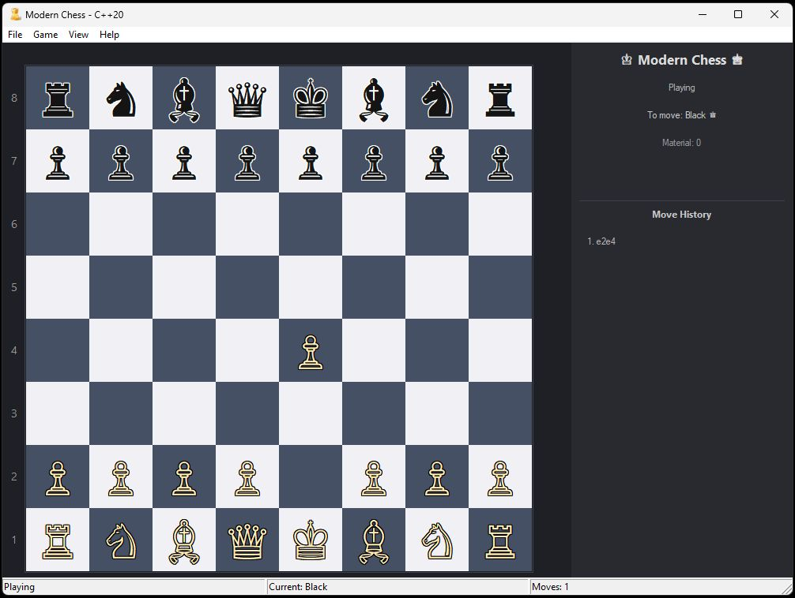

# ♔ Modern Chess Engine




A lightweight, educational chess engine written in modern C++20 with pure WinAPI interface. Perfect for learning how chess engines work without diving through hundreds of thousands of lines of code.

[](https://www.microsoft.com/windows)
[](https://isocpp.org/)
[](LICENSE)
[](https://github.com/wesmar/Chess/releases)

## Why This Project?

Most chess engines are either too simple (lacking modern techniques) or too complex (thousands of files, external dependencies). This project aims to be **educational yet powerful** - implementing professional chess engine techniques in clean, readable code.

## Key Features

### 🎯 Extreme Optimization
- **No CRT version**: < 200 KB
- **With CRT version**: < 500 KB
- **Zero external dependencies** - no Qt, SDL, or .NET
- **Portable**: Even runs in Windows Recovery Environment (WinRE)!

### 🧠 Professional Engine Techniques
- **Minimax with Alpha-Beta Pruning** - efficient move tree search
- **Iterative Deepening** - finds best move within time limit
- **Zobrist Hashing** - lightning-fast position comparison
- **Transposition Table** - avoids re-analyzing same positions
- **Quiescence Search** - eliminates horizon effect
- **Move Ordering (MVV-LVA)** - prioritizes captures for faster pruning
- **Killer Move Heuristic** - remembers good non-capture moves

### 🎨 User Interface
- **Unicode Rendering** - clean chess pieces (♔♕♖♗♘♙)
- **Full Chess Rules** - castling, en passant, pawn promotion
- **Move History** - algebraic notation
- **Undo/Redo** - take back moves
- **PGN Support** - save and load games
- **Multiple Game Modes** - Human vs Human, Human vs AI, AI vs AI
- **10 Difficulty Levels** - from beginner to expert

## Quick Start

### Download
Grab the latest release from [Releases](https://github.com/wesmar/Chess/releases):
- `Chess_x64.exe` - 64-bit version (~480 KB)
- `Chess_x64_minSize.exe` - 64-bit minimal (~170 KB)
- `Chess_x86.exe` - 32-bit version (~400 KB)
- `Chess_x86_minSize.exe` - 32-bit minimal (~140 KB)

Just download and run - no installation needed!

### Building from Source

**Requirements:**
- Windows 10 or later
- Visual Studio 2026 with C++20 support (v145 toolset)
- Should also compile with Visual Studio 2022 or newer

**Build Steps:**
```batch
# Clone the repository
git clone https://github.com/wesmar/Chess.git
cd Chess

# Build all configurations using build_all.bat
# Uses /BREPRO flag for reproducible builds
build_all.bat

# Binaries will be in the 'bin' folder
```

**Manual Build:**
```batch
# Open Developer Command Prompt for VS 2026
# Navigate to project directory

# Build 64-bit release
msbuild Chess.vcxproj /p:Configuration=Release /p:Platform=x64

# Build 64-bit minimal size
msbuild Chess.vcxproj /p:Configuration=Release_MinSize /p:Platform=x64
```

## Project Structure

```
Chess/
├── Engine/          # Chess engine core
│   ├── Board.cpp    # Board representation and move execution
│   ├── MoveGenerator.cpp  # Legal move generation
│   ├── Evaluation.cpp     # Position evaluation
│   ├── TranspositionTable.cpp
│   └── Zobrist.cpp
├── UI/              # User interface
│   ├── WinApp.cpp   # Main window and event handling
│   ├── ChessGame.cpp # Game state management
│   └── VectorRenderer.cpp # Board rendering
└── Resources/       # Icons and resource files
```

## Learning the Code

If you're new to chess programming, here's a suggested reading order:

1. **Start with `Board.cpp`** - This is where all the chess magic happens (piece movement, rule validation)
2. **Then `Evaluation.cpp`** - Learn how the computer "thinks" about positions
3. **Move to `MoveGenerator.cpp`** - See how legal moves are generated
4. **Finally `ChessGame.cpp`** - Understand the AI's decision-making process (alpha-beta search)

### Key Concepts Explained

**Piece-Square Tables (PST)**: Arrays that assign values to pieces based on their position. For example, knights are worth more in the center than on the edge.

**Alpha-Beta Pruning**: If you find a move that's already better than the best option your opponent has, you don't need to check other moves in that branch.

**Transposition Table**: Chess positions can be reached through different move orders. The table remembers positions we've already evaluated.

## Settings

The game creates and saves your preferences in `settings.ini` (created automatically on first run):
```ini
[Display]
FlipBoard=0
ShowCoordinates=1
ShowLegalMoves=1
AnimateMoves=1
AnimationSpeed=300

[Game]
GameMode=1          # 0=HvH, 1=HvC, 2=CvC
AIDifficulty=3      # 1-10
AutoPromoteQueen=1

[Colors]
LightSquare=240,240,245
DarkSquare=70,80,100
```

## Keyboard Shortcuts

- **Ctrl+N** - New game
- **Ctrl+Z** - Undo move
- **Ctrl+Y** - Redo move
- **F** - Flip board
- **L** - Toggle legal moves display
- **C** - Toggle coordinates
- **Esc** - Clear selection

## Technical Details

### Why So Small?

1. **No External Libraries** - Pure WinAPI, no MFC/ATL/Qt
2. **Static Linking** - Everything in one executable
3. **Smart Optimization** - Compiler flags tuned for size
4. **Minimal CRT** - Optional CRT-free build
5. **Reproducible Builds** - Uses /BREPRO flag for deterministic output

### What's Missing (Future Improvements)

- **Null Move Pruning** - Advanced search optimization
- **Late Move Reduction (LMR)** - Deeper search capability
- **Opening Book** - Pre-computed opening moves
- **Endgame Tablebases** - Perfect play in simple endgames

## FAQ

**Q: Why WinAPI and not cross-platform?**  
A: This is an educational project focused on simplicity. WinAPI provides everything needed without extra abstraction layers. A cross-platform version would require SDL/SFML, adding complexity.

**Q: Can it beat me?**  
A: It has 10 difficulty levels ranging from beginner-friendly to challenging. Try different levels to find your match!

**Q: Can I modify it for my own learning?**  
A: Absolutely! That's the point. The code is well-commented and structured for learning.

**Q: Does it work on Windows 7/8?**  
A: The code uses Windows 10+ APIs, but could be adapted for older systems with minor changes.

## Contributing

Found a bug? Have an improvement idea? Feel free to:
1. Open an issue describing the problem/suggestion
2. Fork the repository
3. Create a pull request

Please keep changes focused and well-documented!

## License

MIT License - see [LICENSE](LICENSE) file for details.

## Acknowledgments

This project was created during Christmas 2025/2026 as an educational chess engine. Special thanks to the chess programming community for their excellent resources:
- [Chess Programming Wiki](https://www.chessprogramming.org/)
- [Bruce Moreland's Programming Topics](https://web.archive.org/web/20071026090003/http://www.brucemo.com/compchess/programming/index.htm)

## Author

**Marek Wesołowski** (WESMAR)  
📧 marek@wesolowski.eu.org  
🌐 [kvc.pl](https://kvc.pl)

---

*Made with ♟️ in C++20*